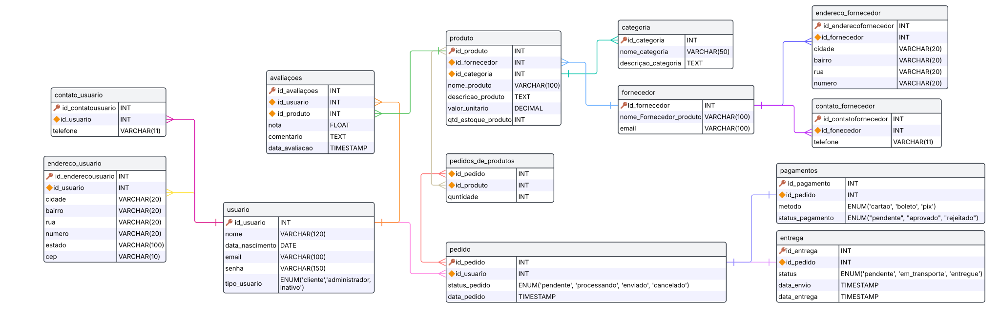

# Projeto de Banco de Dados para um E-Commerce

### Descricao do projeto

Trabalho da faculdade de Banco de Dados que consisteiu em projetar e implementar um banco de dados relacional para um site de e-commerce, contemplando os principais requisitos de um sistema de comércio eletrônico e garantindo a normalização adequada.

### Requisitos Funcionais do Banco de Dados

1. O banco de dados deve contemplar pelo menos as seguintes entidades e funcionalidades:
* Usuários: Cadastro de clientes e administradores com diferentes níveis de
permissão.
* Produtos: Cada produto deve ter nome, descrição, categoria, preço,
quantidade em estoque e fornecedor.
* Pedidos: Um usuário pode realizar pedidos com múltiplos itens.
* Pagamentos: Registro dos pagamentos efetuados (cartão, boleto, PIX,
etc.).
* Entrega: Endereço de envio e status da entrega.
* Avaliações: Usuários podem avaliar produtos.

2. Regras de Normalização
* O banco deve estar no mínimo na 3ª Forma Normal (3FN) para evitar
redundância e inconsistências.

3. Consultas SQL Obrigatórias

* Listar os produtos mais vendidos.
* Listar os clientes que mais compraram no último mês.
* Verificar o estoque baixo de produtos.
* Consultar o faturamento por período.
* Obter a média de avaliações de cada produto.

### Diagrama entidade relacionamento

